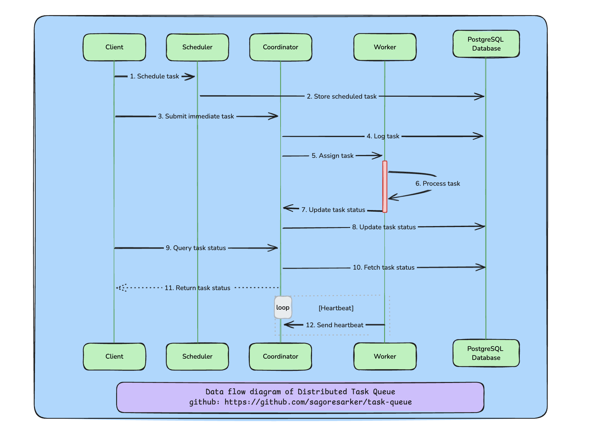

# Task Queue System

## Overview
This project implements a distributed task queue system using Go. It consists of multiple components working together to schedule, manage, and execute tasks efficiently.

## Dataflow diagram for the Distributed Task Queue System

*Data flow diagram of Distributed Task Queue System*

## Components
1. **Coordinator**: The central component that manages task distribution and tracks execution status.
2. **Worker**: Executes tasks assigned by the Coordinator.
3. **Scheduler**: Handles task scheduling and insertion into the database.
4. **PostgreSQL Database**: Stores task information and status.

## Features
- Task scheduling with specified execution times.
- Distributed task execution across multiple workers.
- Real-time task status updates.
- REST API for task submission, scheduling, and status checking.
- gRPC communication between components for efficient data transfer.
- Persistent storage of tasks and their statuses in PostgreSQL.
- Heartbeat mechanism to manage worker availability.

## Architecture
The system follows a distributed architecture:
- Clients interact with the Scheduler to schedule tasks and the Coordinator to submit immediate tasks or check status.
- The Coordinator manages a pool of Workers, distributing tasks and collecting status updates.
- Workers execute tasks and report back to the Coordinator.
- All task information is persisted in the PostgreSQL database.

## Getting Started

### Prerequisites
- Go 1.21 or higher
- Docker and Docker Compose
- PostgreSQL

### Installation
1. Clone the repository:
   ```bash
   git clone https://github.com/sagoresarker/task-queue.git
   ```
2. Navigate to the project directory:
   ```bash
   cd task-queue
   ```
3. Build the project:
   ```bash
   docker-compose build
   ```

### Usage
1. Start the system:
   ```bash
   docker-compose up
   ```
2. The system exposes the following services:
   - Scheduler API: `http://localhost:8081`
   - Coordinator API: `http://localhost:8080`

3. To schedule a task:
   ```bash
   curl -X POST http://localhost:8081/schedule -d '{"command":"your_task_command", "scheduled_at":"2023-04-01T15:04:05Z"}'
   ```

4. To check task status:
   ```bash
   curl http://localhost:8081/status?task_id=your_task_id
   ```

## Development
- The project uses Protocol Buffers for defining the gRPC service interfaces.
- To modify the gRPC definitions, edit the `pkg/grpcapi/api.proto` file and regenerate the Go code using the `pkg/grpcapi/build.sh` script.

